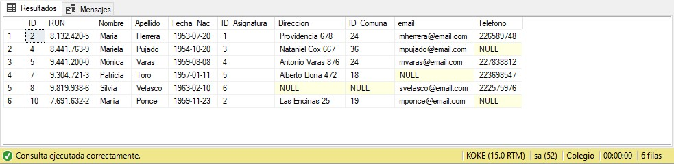
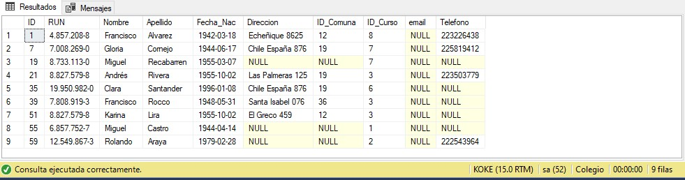
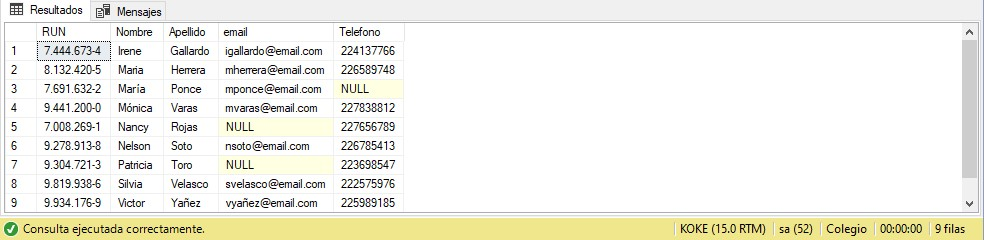
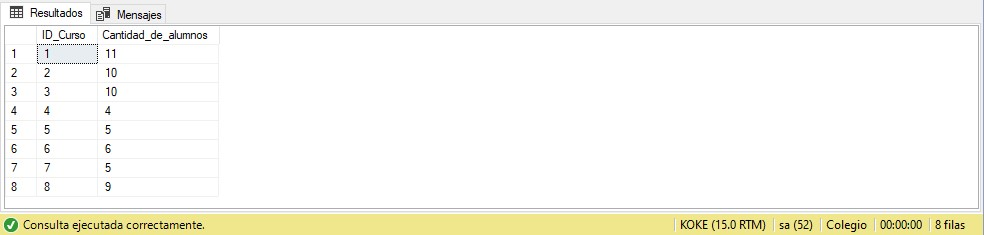

# Manejo de Queries para la Extracción y Análisis de Datos con SQL Server - PUC Chile

Este proyecto fue parte del curso "Manejo de Queries para la Extracción y Análisis de Datos con SQL" realizado en la Pontificia Universidad Católica de Chile. En la Prueba 2 del curso, trabajé en la creación, relación y consulta de una base de datos que representaba un sistema de gestión de un colegio. El objetivo principal fue desarrollar habilidades para construir y gestionar bases de datos relacionales en **SQL Server** y realizar consultas SQL eficientes para la extracción y análisis de datos.

## Componentes del Proyecto

1. **Creación de la Base de Datos Colegio en SQL Server**:
   - Se creó una base de datos relacional llamada **"Colegio"** utilizando **SQL Server**, que representaba la estructura de datos necesaria para la administración de un colegio, incluyendo tablas para **estudiantes, profesores, cursos, y asignaciones**.

2. **Modelado de Tablas y Relaciones**:
   - Se crearon las tablas de la base de datos a partir de la información proporcionada, respetando los nombres de las columnas y definiendo correctamente los tipos de datos y las relaciones.
   - Se establecieron **relaciones entre las tablas** siguiendo un **diagrama entidad-relación** (ERD) proporcionado en la prueba.

3. **Población de Datos**:
   - Los datos fueron poblados usando un script proporcionado, garantizando que la base de datos estuviera completamente cargada y lista para ser consultada.

4. **Consultas SQL Realizadas**:
   - Se desarrollaron varias consultas SQL complejas en SQL Server para responder preguntas específicas y realizar análisis sobre los datos. Las consultas fueron diseñadas para:
     - Obtener información detallada de **estudiantes matriculados**, **asignaciones de cursos**, y **rendimiento**.
     - Realizar análisis cruzados entre las diferentes tablas del sistema.

   ### Consultas Incluidas
   - **Consultas Simples**:
     - **Querys 1 - 6**: `SELECT *` a cada tabla para verificar si tienen datos.
   - **Consultas Avanzadas**:
     - **Query 7**: Seleccionar profesores cuyo nombre termine con la letra **"a"**.
     - **Query 8**: Seleccionar **alumnos sin email** registrado.
     - **Query 9**: Seleccionar **profesores sin dirección o sin email**.
     - **Query 10**: Seleccionar profesores que **no sean de Santiago** (ID de Comuna 36), incluyendo los que no tienen comuna, mostrando **RUN, nombre, apellido, email y teléfono**, ordenados por nombre de manera ascendente.
     - **Query 11**: Seleccionar el **nombre, apellido, ID de asignatura** (Alias: Asignatura), **dirección e ID de comuna** (Alias: Comuna) de los profesores.
     - **Query 12**: Mostrar la **cantidad de alumnos por curso**, mostrando únicamente el **ID del curso** y su cantidad de alumnos.

## Archivos Incluidos

- **Jorge Auad.sql**: Archivo que contiene todas las consultas y los scripts necesarios para la creación de la base de datos, la inserción de datos, y la ejecución de consultas solicitadas en la prueba.
- **Pauta del Ejercicio (PDF)**: Documento con las instrucciones de la prueba que orientaron la construcción del proyecto.

## Resultados

A continuación se muestran algunos de los resultados obtenidos al ejecutar las consultas en SQL Server:

### Resultado de la Consulta 7
- **Profesores cuyo nombre termina con la letra "a"**:
  

### Resultado de la Consulta 8
- **Alumnos sin email registrado**:
  

### Resultado de la Consulta 9
- **Profesores sin dirección o sin email**:
  

### Resultado de la Consulta 10
- **Profesores que no son de Santiago (ID Comuna 36)**:
  

### Resultado de la Consulta 11
- **Alumnos sin dirección ni email**:
  

### Resultado de la Consulta 12
- **Cantidad de alumnos por curso**:
  

## Habilidades Aplicadas

- **SQL Server**: Creación, gestión, y consulta de bases de datos relacionales usando SQL Server, una de las plataformas más utilizadas en la industria.
- **Modelado de Datos Relacional**: Creación de tablas y establecimiento de relaciones, siguiendo las mejores prácticas para bases de datos.
- **SQL (Structured Query Language)**: Creación de consultas avanzadas para la extracción y análisis de datos.
- **Data Analysis (Análisis de Datos)**: Uso de SQL para analizar información relevante sobre estudiantes, profesores, y cursos.

## Enlace al Proyecto Interactivo

Puedes acceder al proyecto en mi perfil de GitHub aquí: [Repositorio del Proyecto](https://github.com/tu_usuario/sql-server-gestion-colegio)

## Sobre el Proyecto

Este proyecto demuestra habilidades en:
- **Gestión y modelado de bases de datos relacionales** con **SQL Server**.
- **Extracción de datos** utilizando consultas complejas para análisis específicos.
- **Creación de medidas y consultas** avanzadas para obtener insights a partir de los datos de gestión del colegio.

## Contacto

Si deseas más información o tienes alguna duda, no dudes en contactarme a través de [mi perfil de GitHub](https://github.com/tu_usuario).

