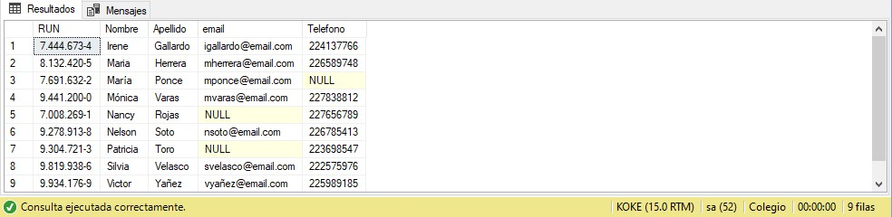
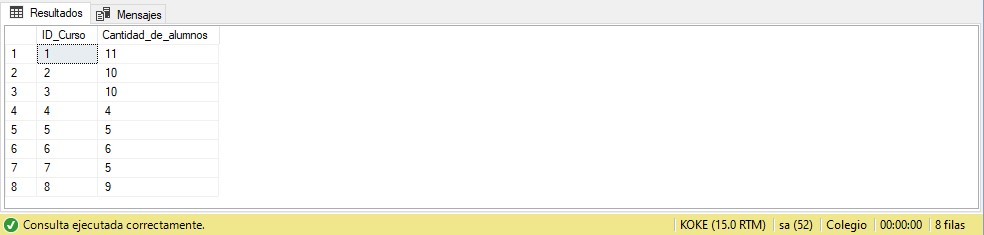

# Gestión de Datos Escolares con SQL Server

Proyecto académico de **SQL Server y T-SQL** presentado como portafolio técnico. Corresponde a la **Prueba 2** del curso **“Manejo de Queries para la Extracción y Análisis de Datos con SQL”** de Educación Continua UC.

La presentación actual conserva la lógica y los **datos ficticios originales de la evaluación**, pero reorganiza el repositorio para que un reclutador técnico pueda distinguir con claridad el trabajo realizado, el material proporcionado por el curso y las mejoras posteriores de portafolio.

## Resumen técnico

| Aspecto | Detalle |
|---|---|
| Motor | Microsoft SQL Server |
| Lenguaje | T-SQL |
| Esquema | 6 tablas, 6 claves foráneas |
| Dataset | Datos ficticios proporcionados por el curso |
| Volumen | 37 comunas, 7 asignaturas, 8 cursos, 11 profesores, 60 alumnos y 200 registros de clase |
| Evaluación original | Prueba 2 — Creación de Tablas y Consultas |
| Nivel que demuestra | Fundamentos de DDL, integridad referencial, filtros, valores nulos, ordenamiento y agregación |

## Qué hice realmente en la evaluación

La pauta original permite separar con precisión el material entregado por el curso del trabajo que debía desarrollar el estudiante.

| Parte | Origen | Trabajo realizado |
|---|---|---|
| Crear la base de datos Colegio | Requerimiento de la prueba | Creación de la base de datos |
| Crear las tablas | Estructura indicada en un Excel adjunto | Implementación de tablas, columnas y tipos en SQL Server |
| Crear las relaciones | Diagrama entregado por el curso | Implementación de claves foráneas según el modelo proporcionado |
| Poblar las tablas | `Datos_Tablas.sql` entregado por el curso | Ejecución e integración de los datos ficticios proporcionados |
| Resolver consultas | Requerimientos entregados en `Consultas.txt` | Desarrollo de las consultas SQL de la evaluación |

La ponderación de la prueba era **20% creación de tablas, 5% relaciones, 5% poblado y 70% consultas**, por lo que el núcleo evaluado fue la resolución de consultas.

Más detalle: [docs/assignment_scope.md](docs/assignment_scope.md).

## Modelo relacional implementado

~~~mermaid
erDiagram
    ASIGNATURA o|--o{ PROFESOR : "asignada a"
    COMUNA o|--o{ PROFESOR : "residencia"
    COMUNA o|--o{ ALUMNO : "residencia"
    CURSO o|--o{ ALUMNO : "matricula"
    PROFESOR ||--o{ CLASE : "participa"
    ALUMNO ||--o{ CLASE : "participa"

    PROFESOR {
        int ID PK
        nvarchar RUN
        nvarchar Nombre
        nvarchar Apellido
        date Fecha_Nac
        int ID_Asignatura FK
        nvarchar Direccion
        int ID_Comuna FK
        nvarchar email
        nvarchar Telefono
    }

    ALUMNO {
        int ID PK
        nvarchar RUN
        nvarchar Nombre
        nvarchar Apellido
        date Fecha_Nac
        nvarchar Direccion
        int ID_Comuna FK
        int ID_Curso FK
        nvarchar email
        nvarchar Telefono
    }

    ASIGNATURA {
        int ID PK
        nvarchar Nombre
    }

    COMUNA {
        int ID PK
        nvarchar Nombre
    }

    CURSO {
        int ID PK
        nvarchar Nombre
    }

    CLASE {
        int ID PK
        int ID_Profesor FK
        int ID_Alumno FK
    }
~~~

El diseño relacional fue proporcionado como referencia en la evaluación; el trabajo consistió en implementarlo correctamente mediante tablas, claves primarias y claves foráneas.

## Consultas de la evaluación

Las consultas 1 a 6 verifican el contenido de las seis tablas. Las consultas 7 a 12 aplican:

| Query | Requerimiento | Conceptos |
|---|---|---|
| 7 | Profesores cuyo nombre termina en “a” | `LIKE` |
| 8 | Alumnos sin email | `IS NULL` |
| 9 | Profesores sin dirección o sin email | `IS NULL`, `OR` |
| 10 | Profesores fuera de Santiago, incluyendo comuna no informada | comparación, `IS NULL`, `OR`, `ORDER BY` |
| 11 | Selección de atributos y alias de columnas | proyección, alias |
| 12 | Cantidad de alumnos por curso | `COUNT`, `GROUP BY` |

Código de portafolio: [sql/03_queries.sql](sql/03_queries.sql).

Entrega académica original: [original/Jorge_Auad_Prueba2.sql](original/Jorge_Auad_Prueba2.sql).

## Datos de la evaluación

Los registros de profesores y alumnos utilizados en la prueba son **ficticios** y fueron proporcionados por el curso mediante el archivo de carga de datos.

La versión de portafolio conserva esos valores para que:

- los resultados sigan siendo comparables con la evaluación original;
- las capturas de SSMS continúen correspondiendo al código;
- el proyecto mantenga trazabilidad entre pauta, datos, consultas y resultados.

La carga modular está en [sql/02_seed_course_data.sql](sql/02_seed_course_data.sql).

## Evidencia de ejecución

<table>
  <tr>
    <td width="50%"><strong>Query 10 — Profesores fuera de Santiago</strong></td>
    <td width="50%"><strong>Query 12 — Cantidad de alumnos por curso</strong></td>
  </tr>
  <tr>
    <td></td>
    <td></td>
  </tr>
</table>

Galería completa: [resultados/README.md](resultados/README.md).

## Estructura

~~~text
.
├── README.md
├── .gitignore
├── sql/
│   ├── 01_schema.sql
│   ├── 02_seed_course_data.sql
│   ├── 03_queries.sql
│   └── 04_data_quality_checks.sql
├── original/
│   └── Jorge_Auad_Prueba2.sql
├── resultados/
│   ├── README.md
│   └── capturas de ejecución en SSMS
└── docs/
    ├── assignment_scope.md
    ├── data_dictionary.md
    ├── query_results.md
    └── technical_review.md
~~~

## Cómo ejecutar

### Requisitos

- Microsoft SQL Server.
- SQL Server Management Studio (SSMS), Azure Data Studio o cliente compatible con T-SQL.

### Versión modular de portafolio

1. Ejecutar [sql/01_schema.sql](sql/01_schema.sql).
2. Ejecutar [sql/02_seed_course_data.sql](sql/02_seed_course_data.sql).
3. Ejecutar [sql/03_queries.sql](sql/03_queries.sql).
4. Opcionalmente, ejecutar [sql/04_data_quality_checks.sql](sql/04_data_quality_checks.sql).

La versión modular utiliza la base **ColegioPortfolio** para que pueda coexistir con la entrega académica original.

### Entrega original

El archivo [original/Jorge_Auad_Prueba2.sql](original/Jorge_Auad_Prueba2.sql) se conserva sin alterar como evidencia de lo que fue entregado en el curso.

## Resultado destacado

La Query 12 produce la distribución original:

| ID_Curso | Cantidad_de_alumnos |
|---:|---:|
| 1 | 11 |
| 2 | 10 |
| 3 | 10 |
| 4 | 4 |
| 5 | 5 |
| 6 | 6 |
| 7 | 5 |
| 8 | 9 |

Más resultados: [docs/query_results.md](docs/query_results.md).

## Extensión de calidad de datos

[sql/04_data_quality_checks.sql](sql/04_data_quality_checks.sql) es una mejora posterior al curso y está separada explícitamente de la evaluación original.

Entre otras cosas, permite detectar que el dataset ficticio de alumnos contiene **RUN repetidos**. Esto no modifica los datos entregados por el curso: documenta una observación de calidad sobre ellos.

## Revisión técnica

La profesionalización incorpora:

- separación entre esquema, datos y consultas;
- objetos calificados con `dbo`;
- listas explícitas de columnas en los `INSERT`;
- conservación de la entrega académica original;
- evidencia visual de ejecución;
- diccionario de datos y resultados esperados;
- controles de calidad claramente identificados como extensión posterior;
- documentación explícita de autoría y alcance.

Para un sistema productivo todavía habría que evaluar índices, restricciones de unicidad, reglas de negocio, transacciones, manejo de errores, seguridad y permisos.

Detalle: [docs/technical_review.md](docs/technical_review.md).

## Alcance técnico

Este proyecto demuestra **fundamentos de SQL Server**. No se presenta como evidencia de SQL avanzado, tuning, administración de servidores, procedimientos almacenados, CTE o funciones de ventana.

---

**Autor:** Jorge Auad Oliva  
**Contexto académico:** Educación Continua, Pontificia Universidad Católica de Chile
