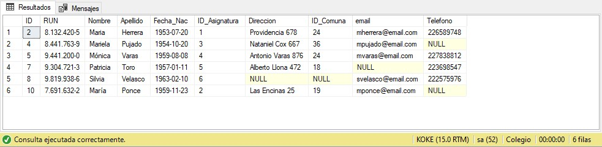
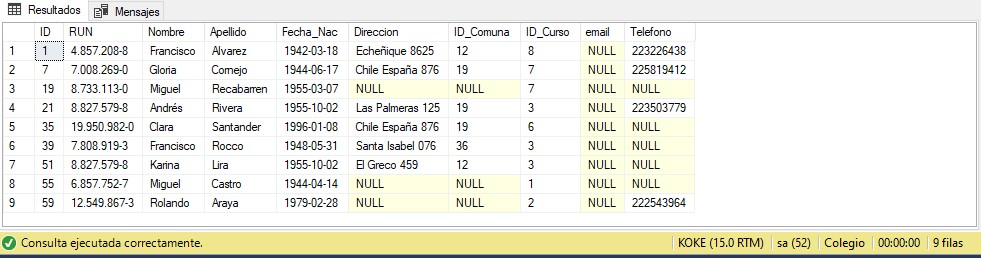
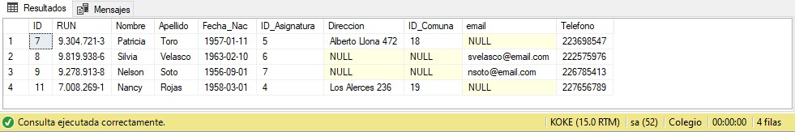
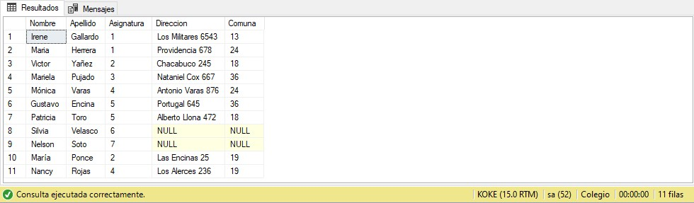

# Evidencia de ejecución en SQL Server Management Studio

Las capturas corresponden a la ejecución de las consultas sobre los **datos ficticios originales proporcionados por el curso**.

<table>
  <tr>
    <td width="50%"><strong>Query 7</strong> Profesores cuyo nombre termina en “a”</td>
    <td width="50%"><strong>Query 8</strong> Alumnos sin email</td>
  </tr>
  <tr>
    <td></td>
    <td></td>
  </tr>
  <tr>
    <td><strong>Query 9</strong> Profesores sin dirección o sin email</td>
    <td><strong>Query 10</strong> Profesores fuera de Santiago</td>
  </tr>
  <tr>
    <td></td>
    <td></td>
  </tr>
  <tr>
    <td><strong>Query 11</strong> Atributos seleccionados de profesores</td>
    <td><strong>Query 12</strong> Cantidad de alumnos por curso</td>
  </tr>
  <tr>
    <td></td>
    <td></td>
  </tr>
</table>

Las imágenes son evidencia de ejecución en SSMS; el diagrama relacional y la explicación técnica principal están en el [README](../README.md).
